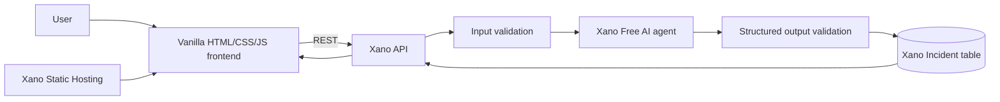

# OpsMate

> 개발자가 시스템 오류의 원인을 빠르게 파악하고 해결 과정을 관리할 수 있도록 돕는 AI 기반 Incident 관리 도구입니다.

**라이브 데모:** [https://opsmate-prod-fdab0e-xq4b-bkh8-ih5r.k7.xano.io](https://opsmate-prod-fdab0e-xq4b-bkh8-ih5r.k7.xano.io)

## OpsMate 소개

OpsMate는 초보 개발자, 학생, 1인 개발자, 소규모 팀을 위한 가벼운 Incident 관리 도구입니다. 서비스명과 오류 로그를 입력하면 오류의 의미를 이해하기 쉽게 설명하고, 가능한 원인과 실제로 확인할 항목을 제안합니다. 심각도를 분류한 분석 결과는 나중에 다시 확인하고 해결 처리할 수 있도록 저장합니다.

## 문제

기존 observability 및 Incident 관리 플랫폼은 강력하지만, 성숙한 인프라와 전문 지식은 물론 대시보드와 알림을 설정할 시간까지 갖추고 있다고 가정하는 경우가 많습니다. 초보 개발자가 `502 Bad Gateway`나 Docker 종료 코드 같은 오류를 마주했을 때 당장 필요한 것은 더 단순합니다. 오류가 무엇을 의미하며 다음으로 무엇을 확인해야 하는지 파악하는 일입니다.

## 해결 방식

OpsMate는 이 과정을 하나의 입력 폼으로 단순화합니다.

1. 문제가 발생한 서비스와 오류 로그를 입력합니다.
2. 구조화된 AI 분석 결과를 받습니다.
3. 가능한 원인과 권장 해결 순서를 확인합니다.
4. Incident를 기록에 저장합니다.
5. 문제가 해결되면 resolved 상태로 변경합니다.

### 범용 LLM 대화와의 차이

OpsMate는 범용 LLM을 대체하려는 서비스가 아닙니다. ChatGPT와 같은 LLM에 오류 로그를 입력해 원인과 해결 방법을 물어볼 수도 있지만, 일반적인 대화는 답변을 받은 뒤 끝나는 일회성 질의응답에 가깝습니다. OpsMate는 AI 분석을 Incident 관리 흐름에 연결해 구조화된 요약과 원인·해결 순서, 심각도 분류, 결과 저장, 이력 조회, 해결 상태 추적, `resolved_at` 기록까지 하나의 과정으로 관리합니다.

핵심 차이는 LLM이 특정 답변을 생성할 수 있는지가 아니라, 그 결과가 Xano backend의 검증과 비즈니스 로직을 거쳐 Incident 데이터로 영구 저장되고 일관된 workflow로 이어진다는 점입니다.

| 기능 | 일반적인 범용 LLM 대화 | OpsMate |
| --- | --- | --- |
| 오류 설명 | 지원 | 지원 |
| 가능한 원인 제안 | 지원 | 지원 |
| 해결 방법 제안 | 지원 | 지원 |
| 구조화된 Severity 분류 | 프롬프트와 대화 방식에 따라 달라짐 | 고정된 JSON 구조로 생성·검증 |
| Incident 자동 저장 | 별도 시스템 연동 필요 | Xano DB에 자동 저장 |
| Incident History | 대화 기록과 별도로 구현 필요 | 최신순 조회 제공 |
| Open / Resolved 상태 관리 | 별도 workflow 필요 | API와 비즈니스 로직으로 제공 |
| 해결 시각 기록 | 별도 데이터 모델 필요 | 최초 `resolved_at` 기록 |
| 일관된 Incident Workflow | 별도 제품화 필요 | 분석부터 해결 추적까지 연결 |

## 주요 기능

- 이해하기 쉬운 AI 오류 분석
- 구조화된 가능한 원인과 권장 해결 순서
- `low`, `medium`, `high`, `critical` 심각도 분류
- 영구 저장되는 Incident 기록 및 상세 화면
- `resolved_at`을 사용하는 멱등적인 open-to-resolved 처리 흐름
- 반응형 single-page frontend
- Xano Static Hosting을 통한 공개 배포
- Xano의 입력 검증, `404` 응답, AI 출력 검증

## 아키텍처



핵심 `input → AI analysis → validation → database storage → response` 흐름은 Xano backend 내부에서 실행됩니다. 브라우저는 AI provider 인증정보를 전달받거나 관리하지 않습니다.

## Xano Backend

### Incident 모델

| 필드 | 타입 | 용도 |
| --- | --- | --- |
| `id` | integer | 기본 키 |
| `created_at` | timestamp | 생성 시각 |
| `service_name` | text | 오류가 발생한 서비스 |
| `raw_error` | text | 사용자가 입력한 원본 오류 |
| `ai_summary` | text | 이해하기 쉬운 오류 설명 |
| `possible_causes` | JSON array | 가능한 원인 |
| `recommended_actions` | JSON array | 실제로 확인할 다음 단계 |
| `severity` | text | `low`, `medium`, `high`, `critical` 중 하나 |
| `status` | text | `open` 또는 `resolved` |
| `resolved_at` | timestamp/null | 최초 해결 시각 |

### API

Base URL: `https://xq4b-bkh8-ih5r.k7.xano.io/api:opsmate`

| Method | Path | 용도 |
| --- | --- | --- |
| `POST` | `/incidents` | 입력을 검증하고 AI 분석을 실행한 뒤 Incident 저장 |
| `GET` | `/incidents` | 최신순으로 Incident 기록 반환 |
| `GET` | `/incidents/{incident_id}` | 단일 Incident 또는 `404` 반환 |
| `PATCH` | `/incidents/{incident_id}` | 기존 `resolved_at`을 변경하지 않고 Incident를 resolved 상태로 처리 |

생성 요청 예시:

```json
{
  "service_name": "nginx",
  "raw_error": "502 Bad Gateway connect() failed (111: Connection refused)"
}
```

## 사용 기술

- [Xano](https://www.xano.com/) — 데이터베이스, REST API, 검증, 비즈니스 로직, AI 워크플로, 데이터 저장, Static Hosting
- Xano Free AI provider — 구조화된 Incident 분석
- Vanilla HTML, CSS, JavaScript — 별도 의존성이 없는 frontend
- GitHub — 소스 코드 버전 관리
- Codex — 구현, XanoScript 개발, 테스트, 문서화

## 로컬 실행

패키지 설치나 빌드 과정이 필요하지 않습니다.

```powershell
cd frontend
python -m http.server 4173
```

`http://localhost:4173`을 엽니다. frontend는 공개된 OpsMate Xano API를 호출하도록 설정되어 있습니다.

## 프로젝트 구조

```text
frontend/       Static single-page frontend
xano/           XanoScript table, API, and AI agent definitions
docs/devpost/   Devpost-ready submission copy
docs/           Demo script, testing record, and screenshot plan
PROJECT.md      Product scope and success criteria
SETUP_CHANGES.md Environment and Xano change log
```

## 테스트

공개된 backend와 배포된 frontend에서 다음 항목을 테스트했습니다.

- AI Incident 생성 및 데이터베이스 저장
- 필수 입력값 누락 요청 거부
- 기록 정렬 및 새로고침 후 데이터 유지
- Incident 상세 조회
- 존재하지 않는 Incident에 대한 `404` 응답
- open-to-resolved 상태 전환
- resolve를 반복해도 최초 `resolved_at` 유지
- 입력부터 새로고침까지 production 브라우저 흐름
- 가로 overflow가 발생하지 않는 390px 반응형 레이아웃

자세한 테스트 기록은 [docs/testing.md](docs/testing.md)에서 확인할 수 있습니다.

## 스크린샷

Devpost와 GitHub 저장소 갤러리에 사용할 화면 캡처 계획은 [docs/screenshots.md](docs/screenshots.md)에 정리되어 있습니다. 오류 분석 화면, AI 결과, 기록, 해결된 Incident 상세 화면, Xano backend를 포함합니다.

## 개발 과정

프로젝트는 2026년 8월 26일부터 27일까지 개발했습니다. Codex를 사용해 XanoScript를 작성하고 검증했으며, Xano workspace의 모든 변경 사항을 적용 전에 확인했습니다. 실제 API 테스트, frontend 구현, 배포된 UI의 브라우저 테스트를 진행하고 기능 단위로 Git commit을 관리했습니다. Xano에서는 데이터베이스, API 런타임, AI provider, backend 워크플로 엔진, production frontend 호스팅을 하나의 플랫폼으로 구성했습니다.

AI를 활용한 개발과 Xano가 없었다면 데이터베이스/API 구현, 구조화된 AI 워크플로, 호스팅 설정, 반복적인 end-to-end 검증을 위해 더 많은 연동 및 인프라 작업이 필요했을 것입니다.

## Hackathon

**DevNetwork API + Cloud + AI Hackathon 2026**의 Xano Challenge인 **Rebuild a SaaS Tool You Hate**를 위해 개발했습니다.

OpsMate는 대시보드보다 문제에 대한 답이 먼저 필요한 사용자를 위해 Incident 관리와 운영 대시보드의 핵심 흐름을 AI 중심으로 간결하게 구성한 도구입니다.

## 알려진 제한 사항

- MVP는 공개 서비스로 구성되어 있으며 사용자 계정이나 사용자별 데이터 분리 기능이 없습니다.
- 동일한 요청이라도 Xano Free AI의 출력 결과가 달라질 수 있습니다.
- 소규모 해커톤 데이터셋을 대상으로 하므로 기록에 페이지네이션을 적용하지 않았습니다.
- OpsMate는 오류 진단을 위한 안내를 제공하며, 자동 복구나 모니터링 기능은 제공하지 않습니다.

## 제출 자료

- [Devpost 제출 문안](docs/devpost/submission.md)
- [3분 데모 스크립트](docs/demo-script.md)
- [스크린샷 계획](docs/screenshots.md)
- [테스트 기록](docs/testing.md)
