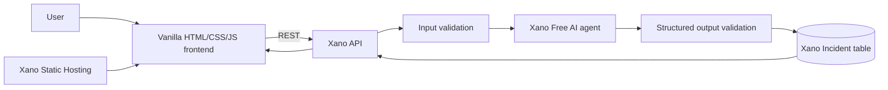

# OpsMate

> AI-powered incident assistant that helps developers understand, track, and resolve system errors faster.

**Live demo:** [https://opsmate-prod-fdab0e-xq4b-bkh8-ih5r.k7.xano.io](https://opsmate-prod-fdab0e-xq4b-bkh8-ih5r.k7.xano.io)

## What is OpsMate?

OpsMate is a lightweight incident management assistant for beginner developers, students, solo builders, and small teams. A user pastes a service name and an error log. OpsMate explains the incident in plain language, suggests likely causes and practical checks, assigns a severity, and stores the result for later review and resolution.

## Problem

Traditional observability and incident management platforms are powerful, but they often assume mature infrastructure, specialist knowledge, and time to configure dashboards and alerts. When a beginner sees an error such as `502 Bad Gateway` or a Docker exit code, the immediate need is simpler: understand what it means and what to check next.

## Solution

OpsMate reduces that workflow to one form:

1. Enter the affected service and error log.
2. Receive a structured AI analysis.
3. Review possible causes and recommended actions.
4. Keep the incident in a persistent history.
5. Mark it resolved when the issue is fixed.

## Features

- Plain-language AI error analysis
- Structured possible causes and recommended actions
- `low`, `medium`, `high`, and `critical` severity classification
- Persistent incident history and detail view
- Idempotent open-to-resolved workflow with `resolved_at`
- Responsive single-page frontend
- Public deployment through Xano Static Hosting
- Input validation, not-found responses, and AI output validation in Xano

## Architecture



The core `input → AI analysis → validation → database storage → response` workflow runs inside the Xano backend. The browser never receives or manages an AI provider credential.

## Xano Backend

### Incident model

| Field | Type | Purpose |
| --- | --- | --- |
| `id` | integer | Primary key |
| `created_at` | timestamp | Creation time |
| `service_name` | text | Affected service |
| `raw_error` | text | Original submitted error |
| `ai_summary` | text | Plain-language explanation |
| `possible_causes` | JSON array | Likely causes |
| `recommended_actions` | JSON array | Practical next steps |
| `severity` | text | `low`, `medium`, `high`, or `critical` |
| `status` | text | `open` or `resolved` |
| `resolved_at` | timestamp/null | First resolution time |

### API

Base URL: `https://xq4b-bkh8-ih5r.k7.xano.io/api:opsmate`

| Method | Path | Purpose |
| --- | --- | --- |
| `POST` | `/incidents` | Validate input, run AI analysis, and store an incident |
| `GET` | `/incidents` | Return incident history newest first |
| `GET` | `/incidents/{incident_id}` | Return one incident or `404` |
| `PATCH` | `/incidents/{incident_id}` | Mark an incident resolved without rewriting an existing `resolved_at` |

Example create request:

```json
{
  "service_name": "nginx",
  "raw_error": "502 Bad Gateway connect() failed (111: Connection refused)"
}
```

## Built With

- [Xano](https://www.xano.com/) — database, REST API, validation, business logic, AI workflow, persistence, and static hosting
- Xano Free AI provider — structured incident analysis
- Vanilla HTML, CSS, and JavaScript — dependency-free frontend
- GitHub — source control
- Codex — implementation, XanoScript development, testing, and documentation

## Run Locally

No package installation or build step is required.

```powershell
cd frontend
python -m http.server 4173
```

Open `http://localhost:4173`. The frontend is configured to call the live public OpsMate Xano API.

## Project Structure

```text
frontend/       Static single-page frontend
xano/           XanoScript table, API, and AI agent definitions
docs/devpost/   Devpost-ready submission copy
docs/           Demo script, testing record, and screenshot plan
PROJECT.md      Product scope and success criteria
SETUP_CHANGES.md Environment and Xano change log
```

## Testing

The live backend and deployed frontend were tested for:

- AI incident creation and database persistence
- Required-field rejection
- History ordering and refresh persistence
- Incident detail retrieval
- `404` for a missing incident
- Open-to-resolved transition
- Repeated resolve preserving the original `resolved_at`
- Production browser flow from input through refresh
- 390px responsive layout without horizontal overflow

Detailed evidence is recorded in [docs/testing.md](docs/testing.md).

## Screenshots

The capture plan for the Devpost and repository gallery is in [docs/screenshots.md](docs/screenshots.md). It covers the analyze screen, AI result, history, resolved detail, and Xano backend.

## Development Process

The project was built across August 26–27, 2026. Codex generated and validated XanoScript, previewed every Xano workspace change, tested the live API, implemented the frontend, exercised the deployed UI in a browser, and kept feature-sized Git commits. Xano provided the database, API runtime, AI provider, backend workflow engine, and production frontend hosting in one platform.

Without AI-assisted development and Xano, the database/API implementation, structured AI workflow, hosting setup, and repeated end-to-end verification would have required substantially more integration and infrastructure work.

## Hackathon

Built for the **DevNetwork API + Cloud + AI Hackathon 2026**, Xano Challenge: **Rebuild a SaaS Tool You Hate**.

OpsMate reimagines the incident management and operations dashboard category as a focused, AI-first tool for people who need an answer before they need a dashboard.

## Known Limitations

- The MVP is intentionally public and has no user accounts or per-user data isolation.
- Xano Free AI output can vary between otherwise identical requests.
- History is unpaginated for the small hackathon dataset.
- OpsMate provides diagnostic guidance, not automatic remediation or monitoring.

## Submission Materials

- [Devpost submission copy](docs/devpost/submission.md)
- [Three-minute demo script](docs/demo-script.md)
- [Screenshot plan](docs/screenshots.md)
- [Test record](docs/testing.md)
